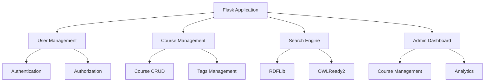

# Learning Platform Documentation

## Table of Contents

1. [Overview](#overview)
2. [System Architecture](#system-architecture)
3. [Technical Specifications](#technical-specifications)
4. [Installation & Setup](#installation-setup)
5. [User Guide](#user-guide)
6. [Admin Guide](#admin-guide)
7. [API Documentation](#api-documentation)
8. [Security](#security)
9. [Performance](#performance)
10. [Troubleshooting](#troubleshooting)
11. [Development Guidelines](#development-guidelines)
12. [Contributing](#contributing)
13. [License](#license)

## Overview

The Learning Platform is a modern, scalable web application designed for educational content management and delivery. It leverages semantic web technologies to provide enhanced search capabilities and a robust admin interface for course management.

### Key Features

- Semantic Search Engine
- Course Management System
- Admin Dashboard
- User Authentication
- Responsive Design
- Real-time Updates

## System Architecture

### 1. Backend Architecture



### 2. Database Schema

```sql
-- Users Table
CREATE TABLE users (
    id INTEGER PRIMARY KEY,
    username VARCHAR(64) UNIQUE NOT NULL,
    email VARCHAR(120) UNIQUE NOT NULL,
    password_hash VARCHAR(128) NOT NULL,
    is_admin BOOLEAN DEFAULT FALSE,
    created_at TIMESTAMP DEFAULT CURRENT_TIMESTAMP
);

-- Courses Table
CREATE TABLE courses (
    id INTEGER PRIMARY KEY,
    title VARCHAR(255) NOT NULL,
    description TEXT NOT NULL,
    semantic_tags TEXT NOT NULL,
    max_students INTEGER NOT NULL,
    duration_weeks INTEGER NOT NULL,
    created_at TIMESTAMP DEFAULT CURRENT_TIMESTAMP
);
```

## Technical Specifications

### 1. Software Requirements

| Component | Version |
|-----------|---------|
| Python    | 3.8+    |
| Flask     | 2.0.1   |
| SQLAlchemy| 1.4.23  |
| RDFLib    | 6.0.0   |
| OWLReady2 | 0.30    |
| Flask-Login| 0.5.0  |

### 2. System Requirements

- RAM: Minimum 4GB recommended
- Storage: Minimum 1GB free space
- CPU: Dual-core processor or better
- Network: Stable internet connection

## Installation & Setup

### 1. Prerequisites

```bash
# Install Python dependencies
pip install -r requirements.txt

# Create database
flask db init
flask db migrate
flask db upgrade
```

### 2. Configuration

Create a `.env` file in the root directory:

```env
SECRET_KEY=your-secret-key-here
DATABASE_URL=sqlite:///app.db
ADMIN_EMAIL=bupechiyana11@gmail.com
ADMIN_PASSWORD=12345qwert
```

### 3. Running the Application

```bash
# Start development server
python app.py

# Access the application
http://localhost:5000
```

## User Guide

### 1. Getting Started

1. **Registration**
   - Visit the homepage
   - Click "Sign Up"
   - Fill in required information
   - Complete registration

2. **Login**
   - Click "Login"
   - Enter credentials
   - Access dashboard

### 2. Course Management

1. **Searching Courses**
   - Use the search bar
   - Type keywords
   - View results
   - Use filters

2. **Enrolling in Courses**
   - Browse courses
   - Click "Enroll"
   - Confirm enrollment
   - Access course materials

## Admin Guide

### 1. Admin Access

Default admin credentials:
- Email: bupechiyana11@gmail.com
- Password: 12345qwert

### 2. Course Management

```python
# Adding a new course
@app.route('/admin/course/add', methods=['POST'])
def add_course():
    course = Course(
        title=request.form['title'],
        description=request.form['description'],
        semantic_tags=request.form['tags'],
        max_students=int(request.form['max_students']),
        duration_weeks=int(request.form['duration_weeks'])
    )
    db.session.add(course)
    db.session.commit()
```

## API Documentation

### 1. Search API

```http
GET /api/search?q={query}

Example:
GET /api/search?q=python

Response:
{
    "courses": [
        {
            "id": 1,
            "title": "Python Basics",
            "description": "Learn the fundamentals of Python programming",
            "tags": ["python", "programming", "beginner"]
        }
    ]
}
```

### 2. Course Management API

```http
POST /api/courses
DELETE /api/courses/{id}
PUT /api/courses/{id}
```

## Security

### 1. Authentication & Authorization

- Password hashing using bcrypt
- Session management with Flask-Login
- CSRF protection
- Rate limiting
- Secure cookie handling

### 2. Data Protection

- Input validation
- SQL injection prevention
- XSS protection
- Secure password storage
- Regular security audits

## Performance

### 1. Optimization Techniques

- Database indexing
- Query optimization
- Caching strategy
- Resource optimization
- Async operations

### 2. Monitoring

- Response time tracking
- Error logging
- Resource usage
- Performance metrics

## Troubleshooting

### Common Issues

1. **Search Not Working**
   ```bash
   # Check database connection
   python -c "import sqlite3; conn = sqlite3.connect('app.db')"
   
   # Verify search index
   python -c "from app import db, Course; print(Course.query.count())"
   ```

2. **Admin Access Issues**
   ```bash
   # Verify admin user
   python -c "
   from app import db, User
   user = User.query.filter_by(email='bupechiyana11@gmail.com').first()
   print(user.is_admin)
   "
   ```

## Development Guidelines

### 1. Code Style

- Follow PEP 8 guidelines
- Use meaningful variable names
- Add docstrings to functions
- Write unit tests
- Maintain clean code

### 2. Version Control

- Use Git for version control
- Follow branching strategy
- Write clear commit messages
- Use pull requests
- Maintain changelog

## Contributing

1. Fork the repository
2. Create a feature branch
3. Commit your changes
4. Push to the branch
5. Create a Pull Request

## License

This project is licensed under the MIT License - see the LICENSE file for details.

## Support

For support, please:

1. Check the documentation
2. Search existing issues
3. Create a new issue
4. Contact the development team
